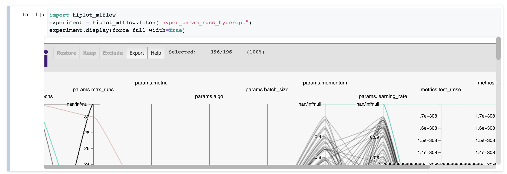
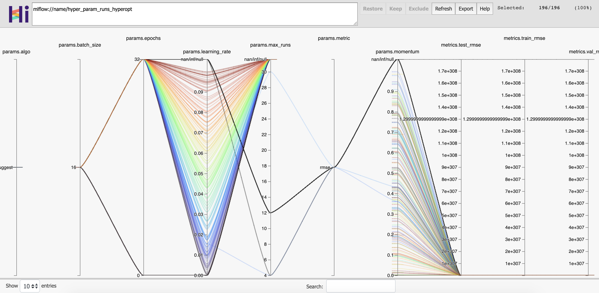
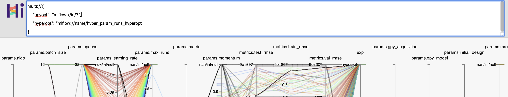

hiplot-mlflow
=============

A  `HiPlot <https://facebookresearch.github.io/hiplot/index.html>`_ experiment
fetcher plugin for `MLflow <https://mlflow.org/>`_, to help visualise your
tracked experiments.

Installation
------------

Install this library with ``pip`` as:

.. code-block:: sh

   pip install hiplot_mlflow

Usage
-----

You can visualise experiments either in a Jupyter notebook or using HiPlot's
built in server.

Notebook
~~~~~~~~

In a Jupyter notebook, use ``hiplot_mlflow.fetch`` to retrieve an MLflow
experiment by name, and display it with HiPlot:

.. code-block:: python

   import hiplot_mlflow
   experiments = hiplot_mlflow.fetch("my-lovely-experiment")
   experiments.display(force_full_width=True)

You can also retrieve experiments by their MLflow experiment ID:

.. code-block:: python

   experiment = hiplot_mlflow.fetch_by_id(0)

By default, MLflow tags are not shown (only MLflow metrics and parameters are
shown). To display them, pass ``include_tag=True`` to either of the fetch
functions, for example:

.. code-block:: python

   experiment = hiplot_mlflow.fetch("my-lovely-experiment", include_tags=True)

See more about what you can do with the returned ``hiplot.Experiment`` values
in the `HiPlot documentation
<https://facebookresearch.github.io/hiplot/experiment_settings.html>`_.

HiPlot Server
~~~~~~~~~~~~~

To use `HiPlot's built in webserver
<https://facebookresearch.github.io/hiplot/tuto_webserver.html>`_ with
``hiplot-mlflow``, you can start it up with the custom `experiment fetcher
<https://facebookresearch.github.io/hiplot/tuto_webserver.html#experiments-uri>`_
implemented by this package:

.. code-block:: sh

   hiplot hiplot_mlflow.fetch_by_uri

You can then use the ``mlflow://`` schema to access MLflow experiments in
HiPlot by either experiment or name, for example::

   mlflow://name/experiment-name
   mlflow://id/0

You can also add ``tags=yes`` as a query string parameter to include tags in
the output, for example::

   mlflow://name/experiment-name?tags=yes

You can also use the `multiple experiments
<https://facebookresearch.github.io/hiplot/tuto_webserver.html#compare-multiple-experiments>`_
loading syntax. Either the dictionary format (to define your own labels)::

   multi://{
       "first-experiment": "mlflow://id/1",
       "another-experiment": "mlflow://name/another-experiment?tags=yes"
   }

or list format::

   multi://[
       "mlflow://id/1",
       "mlflow://name/another-experiment?tags=yes"
   ]

